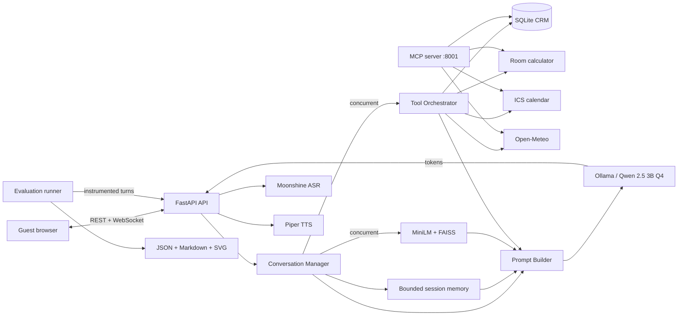

# SmartStay AI — Local Hotel Concierge

A privacy-focused, locally deployed virtual hotel concierge that delivers natural, real-time assistance through both text and voice. Powered by a quantized open-weight language model running entirely on CPU, it maintains multi-turn conversation context, grounds hotel responses in a curated 50-document knowledge base, remembers guest details through a persistent CRM, and handles practical requests such as room-cost estimates, calendar holds, and travel-weather checks.

---

## 🚀 Features

- Fully local, quantized LLM inference through Ollama (no cloud API key required)
- FastAPI REST and JSON WebSocket interfaces with token-by-token streaming
- ChatGPT-style React 18 + Vite interface with new-session support
- Bounded, per-session multi-turn conversation memory
- 50-document hotel knowledge base with FAISS vector search and source citations
- Persistent SQLite CRM — create, read, update, delete, and interaction history
- Deterministic room-cost calculator, local iCalendar stay holds, Open-Meteo weather lookup
- Official MCP server exposing all four tools
- Local Moonshine ASR and Piper TTS with phrase-level pipelining
- Docker Compose services for indexing, API, and MCP
- Evaluation suite: 12 dialogue scenarios, 30 RAG queries, 24 tool-routing cases — JSON, Markdown, and SVG reports

---

## 🛠 Technologies Used

| Layer | Selection |
|---|---|
| Language Model | Qwen 2.5 3B Instruct Q4_K_M via Ollama |
| Backend API | Python 3.11 · FastAPI · Uvicorn · WebSockets |
| Embeddings | `sentence-transformers/all-MiniLM-L6-v2` (384-dim, CPU) |
| Vector Search | FAISS `IndexFlatIP` (exact cosine) |
| Speech Recognition | Moonshine English (local, offline) |
| Speech Synthesis | Piper TTS (local ONNX) |
| Frontend | React 18 · Vite · plain CSS |
| CRM Storage | SQLite |
| Tool Protocol | Official MCP Python SDK |
| Containerization | Docker · Docker Compose |

---

## 📁 Repository Structure

```text
SmartStay-AI/
├── backend/          FastAPI routes, voice pipeline, Dockerfile, Postman collection
├── benchmarks/       RAG/tool and voice latency scripts
├── conversation/     Session manager, memory manager, prompt builder
├── docs/             Assignment history and evaluation methodology
├── evals/            Datasets, evaluators, runner, and reporting
├── examples/         MCP client usage example
├── frontend/         React + Vite chat and voice interface
├── knowledge_base/   50 hotel-domain source documents
├── llm/              Async Ollama streaming client
├── rag/              Index builder, chunker, embeddings, vector store, retriever
├── tests/            Offline regression tests
├── tools/            CRM, calculator, calendar, weather, registry, MCP server
├── Modelfile         Quantized Qwen runtime configuration for Ollama
├── evaluate.py       One-command evaluation entry point
└── requirements-eval.txt
```

---

## 🧠 System Architecture



---

## ⚙️ How to Run (Local)

### Prerequisites

- Python 3.11 or 3.12 · Node.js 18+ · Git
- [Ollama](https://ollama.com) with `qwen2.5:3b-instruct-q4_K_M`
- FFmpeg (voice input) · 16 GB RAM recommended
- Optional: Docker Desktop, Piper `.onnx` voice model

### Setup

```bash
# 1. Clone
git clone https://github.com/ehtisham5618/SmartStay-AI.git
cd SmartStay-AI

# 2. Virtual environment (Windows PowerShell)
py -m venv .venv
.venv\Scripts\Activate.ps1

# 3. Install dependencies
pip install -r backend/requirements.txt -r requirements-eval.txt

# 4. Create the Ollama model
ollama pull qwen2.5:3b-instruct-q4_K_M
ollama create smartstay-qwen -f Modelfile

# 5. Build the knowledge index
python -m rag.build_index

# 6. Install the frontend
cd frontend && npm install && cd ..
```

### Start (three terminals)

```bash
# Terminal 1 — API
uvicorn backend.main:app --host 0.0.0.0 --port 8000

# Terminal 2 — MCP server
python -m tools.mcp_server

# Terminal 3 — Frontend
cd frontend && npm run dev
```

Open `http://localhost:5173`. Check `http://localhost:8000/health` first.

---

## 🐳 Docker

```bash
ollama create smartstay-qwen -f Modelfile
docker compose -f backend/docker-compose.yml build
docker compose -f backend/docker-compose.yml up
```

Services: **indexer** (builds FAISS index, then exits) · **api** (`http://localhost:8000`) · **mcp** (`http://localhost:8001/mcp`)

---

## 🧪 Running the Evaluation

```bash
python evaluate.py                        # Full suite
python evaluate.py --mode validate        # Offline validation only
python evaluate.py --mode correctness     # Correctness metrics only
python evaluate.py --mode performance     # Latency and load only
python evaluate.py --quick                # Smoke test
python evaluate.py --network-tools        # Include live weather check
```

Reports are written to `eval_reports/` as `evaluation.json`, `evaluation.md`, and `latency.svg`.

---

## 🔒 Security and Privacy

- All language, speech, retrieval, CRM, and calculator data remain local
- SQLite queries use parameterized statements; the prompt receives a safe CRM projection only
- This is an academic prototype with no authentication — do not expose publicly with real guest data

---

## 🧩 Concepts Practiced

- Retrieval-Augmented Generation (RAG) with FAISS and MiniLM embeddings
- Asynchronous FastAPI with WebSocket streaming and concurrent session management
- Bounded sliding-window conversation memory
- Local speech recognition (Moonshine) and synthesis (Piper TTS)
- Model Context Protocol (MCP) for standardized tool exposure
- Docker Compose multi-service orchestration
- Evidence-based evaluation: correctness metrics, latency distributions, load testing

---

## 👨‍💻 Author

**Ehtisham Abid**
